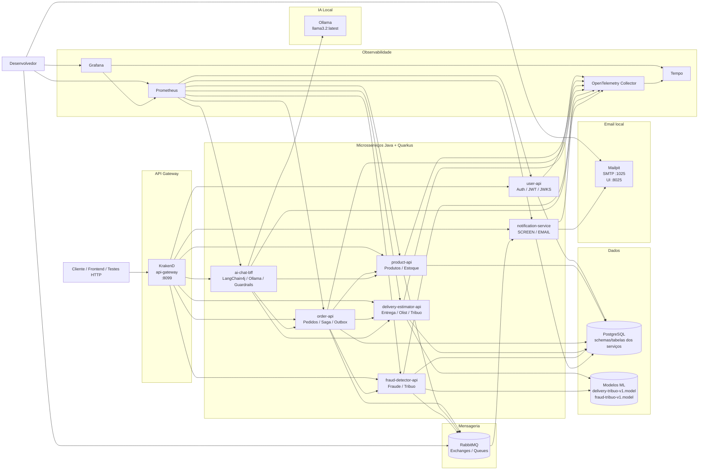
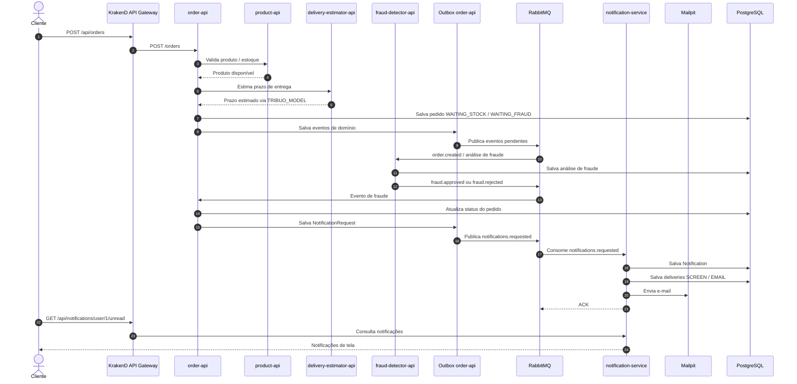
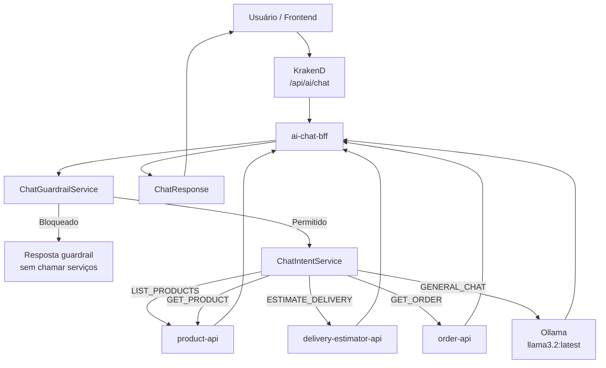
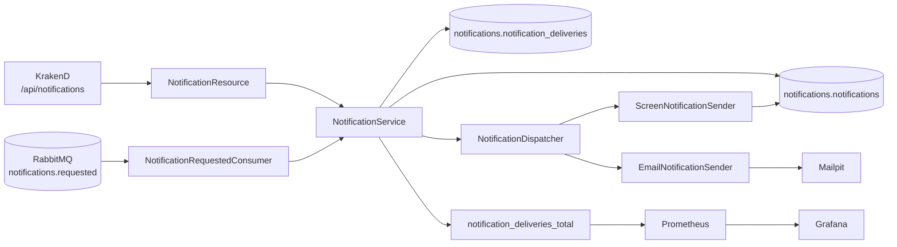
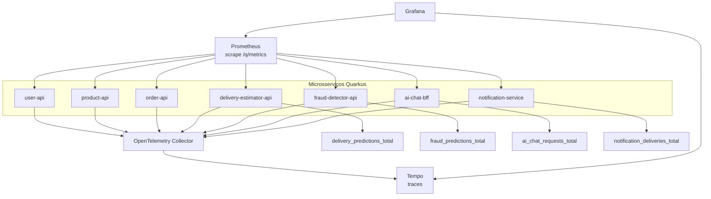
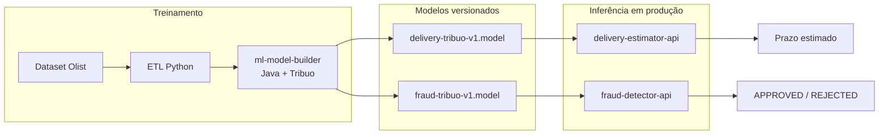

# Diagramas da arquitetura - Ecommerce Microservices

Este arquivo contém diagramas Mermaid da arquitetura atual do projeto, incluindo API Gateway, microsserviços, mensageria, banco, observabilidade, IA/ML e notificações.

---

## 1. Diagrama completo de contexto e containers

---

## 2. Diagrama do fluxo de pedido com notificações

---

## 3. Diagrama do AI Chat BFF

---

## 4. Diagrama do Notification Service

---

## 5. Diagrama de observabilidade

---

## 6. Diagrama de ML

